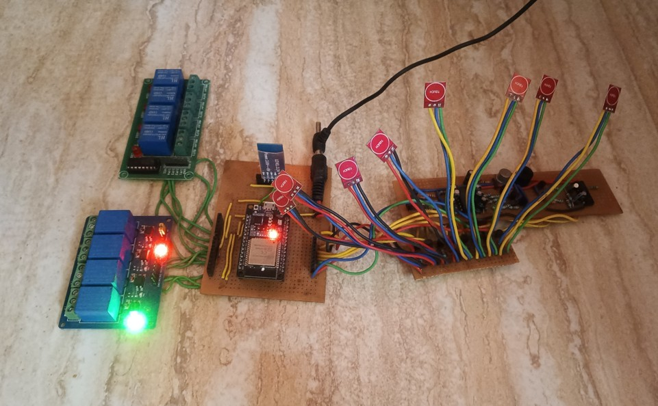
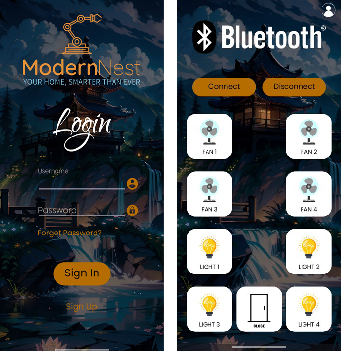
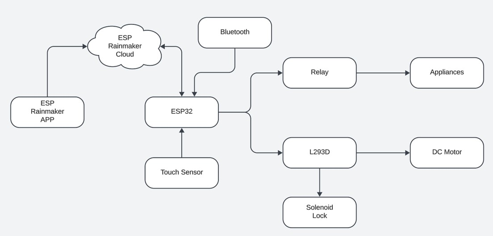
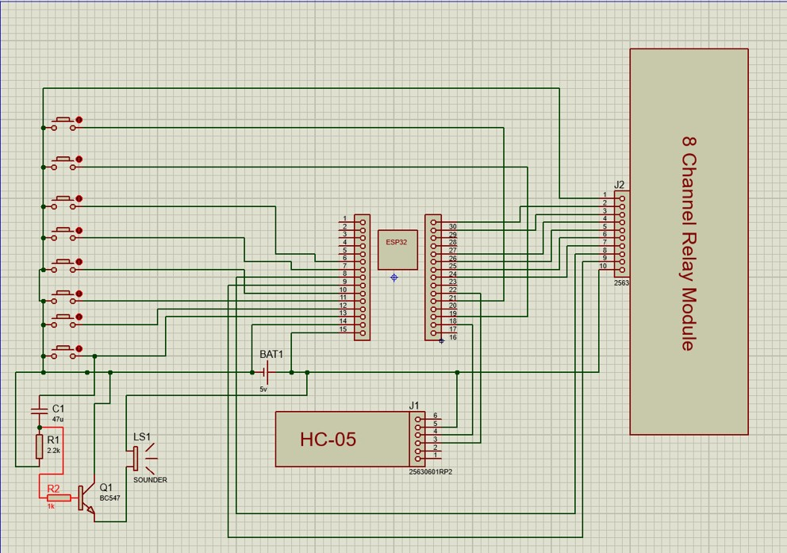
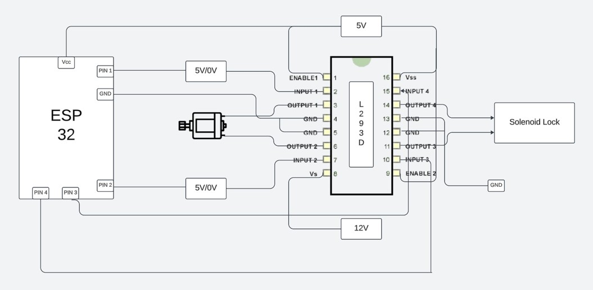

# IoT-Based Smart Home Automation System

## Overview

This is an IoT-based smart home automation system designed to control up to **8 AC appliances** through three modes:

- **Manual Touch Control** (using TTP223 touch sensors)
- **Bluetooth Control** (within ~10 meters using HC-05 and Android app)
- **Cloud Control** (from anywhere in the world via ESP32 and custom Android app)

In addition to appliance control, a **smart sliding door system with locking mechanism** was integrated using a rack and pinion mechanism and solenoid lock. This entire system was implemented and successfully demonstrated in a real-time lab environment.

---

## Features

### 1. Appliance Control

- **Number of Devices:** 4 Lights + 4 Fans (total 8 AC appliances)
- **Control Methods:**
  - Manual touch (TTP223 touch sensors)
  - Bluetooth control (HC-05)
  - Cloud control (ESP32 via Wi-Fi)
- **Relay Driver:** 8-channel relay module

### 2. Smart Sliding Door System

- **Mechanism:** Rack and pinion driven by 12V DC motor
- **Locking:** Solenoid lock
- **Control:** 3 modes (same as above)
- **Driver IC:** L293D to control DC motor and solenoid lock

### 3. Custom Android App

- Built using **Android Studio**
- **Dual Control:** Bluetooth & Cloud
- **User Authentication:** Login and Signup system included for secure access
- Fully custom-designed UI and real-time control

### 4. Real-Time Implementation

- Fully implemented in the **college lab**
- Controlled real lab **lights, fans, and a sliding door**
- Functional and live demo successfully conducted

---

## Devices Used

- **ESP32** – For Wi-Fi based cloud control
- **HC-05 Bluetooth Module** – For short-range wireless communication
- **TTP223 Touch Sensors** – For manual touch-based control
- **8-Channel Relay Module** – To switch AC appliances
- **L293D Motor Driver IC** – For driving the DC motor and solenoid lock
- **12V DC Motor** – For sliding door operation
- **Solenoid Lock** – For smart locking

---

## Project Highlights

- Seamless control of AC appliances using 3 different methods
- Android app development with complete login/signup authentication
- Integration of a smart mechanical door system with electrical locking
- Fully implemented and tested in a real-world lab environment

---

## Repository Structure

```
📁 AndroidApp
    └── Complete source code for the Android app

📁 ESP32_Code
    └── Arduino/ESP32 code for cloud and Bluetooth control

📁 DoorMechanism
    └── Schematics and control code for door motor and lock

📁 Docs
    └── Circuit diagrams, flowcharts, and implementation photos
```

---

## Future Scope

- Add voice assistant support (e.g., Google Assistant)
- Include energy monitoring for each appliance
- Expand to control more appliances using multiplexing
- Real-time notifications for door access or unauthorized entry

---

## License

This project is open-source.

---

## Contributors

- Hithaishi S R
- Team Members: Hemanth M G, Prajwal Patil, Sharvan S

For any questions or collaboration proposals, feel free to reach out!

---

## Screenshots











---

## Contact

> GitHub: [Hithaishi S R](https://github.com/Hithaishisr)  
> Email: hithaishisr2002@gmail.com
